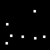
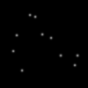
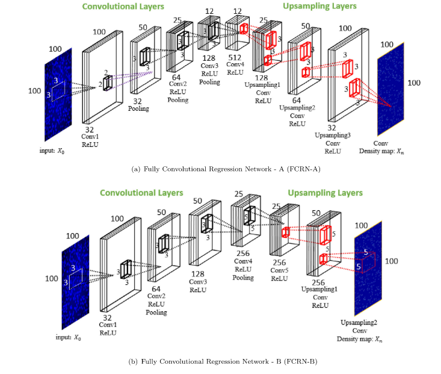
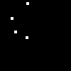
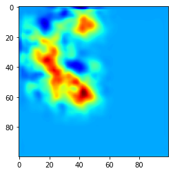
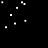
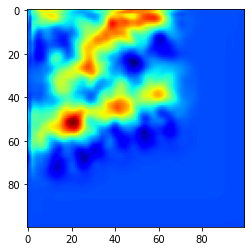

## Goal
In this repository, we implement a fully convolutional regression  networks (FCRNs) approach for regression of a density map in order to get density map of cell pictures for biomedical goals.
## Generation of Database 

Generating squares randomly positionned in a 100x100 image.
First step is to randomly position the squares, then get the coordinates of the center of squares, and apply Gaussian filter over them for ground truth.
Example from dataset : 

<p align="center">
  
&nbsp; &nbsp; &nbsp; &nbsp;
  
</p>

## Network description 

<p align="center">
  
 </p>

## Test on example : 

<p align="center">
  
&nbsp; &nbsp; &nbsp; &nbsp;
  
</p>
<p align="center">
  
&nbsp; &nbsp; &nbsp; &nbsp;
  
</p>

## Requirements : 

```bash
git clone GIT_repo
pip install -r requirements.txt
```

## Training/Validation 

## Testing : 

## 🔗 Links
- [ Paper : Microscopy cell counting and detection with fully convolutional regression networks)](https://www.tandfonline.com/doi/abs/10.1080/21681163.2016.1149104?journalCode=tciv20 "Microscopy cell counting and detection with fully convolutional regression networks")

